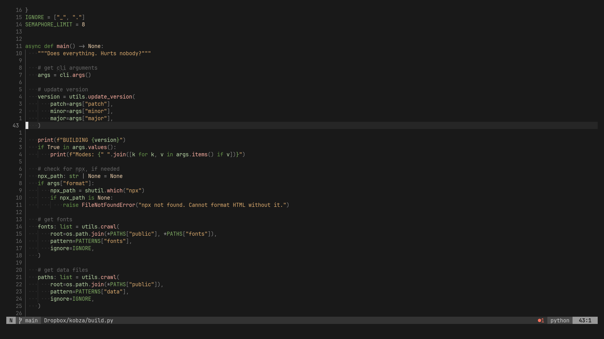
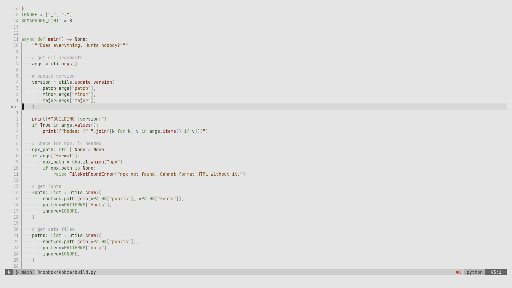

# Flowerpot for Neovim

> This theme is no longer developed.  
> See [Farba](https://github.com/shushtain/farba.nvim) for a better alternative.
>   
> You'll need:
> - `gray = { 0, 0 }`
> - `red = { 10, 100 },`
> - `green = { 90, 50 },`
> - `yellow = { 30, 75 },`
> - `blue = { 90, 50 },`
> - `magenta = { 90, 50 },`
> - `cyan = { 350, 100 }`

Planty of greens.  
So much collard.

## Features

- Neutral background.
- Warm tones, not to stress the eyes.
- Distinctive but modest grouping.

## Support

- Treesitter
- LSP highlights
- Lualine
- Telescope
- Gitsigns
